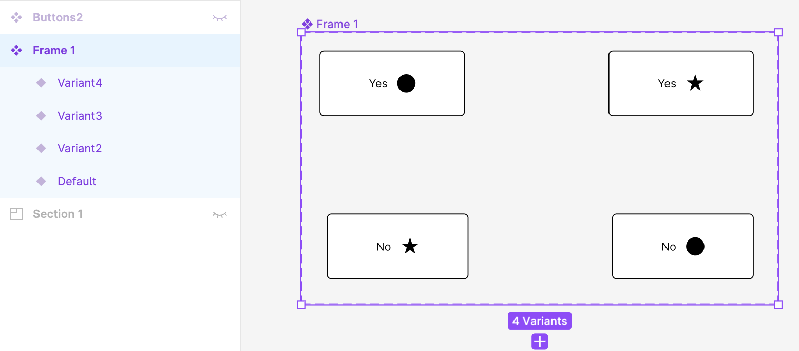
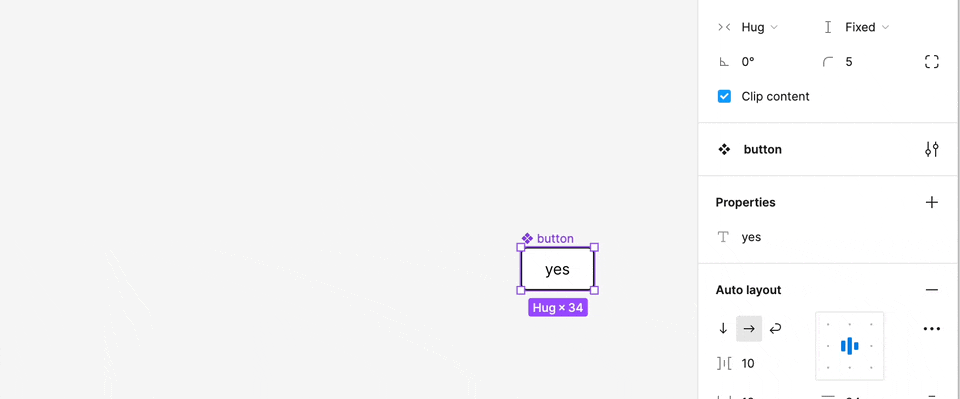

### コンポーネントプロパティとは

コンポーネント内の要素に設定できるプロパティ(キー名とバリューの組み合わせ)

なんのためにあるのか?
- コンポーネント内の要素の値をあらかじめ設定し、使いまわせるようにする仕組み

- 利用次第では、たくさんのvariantプロパティを作成せずとも複数の状態(バリエーション)を管理することができる

[Figma の Component Properties を学ぶ](https://note.com/fjkn/n/n7ead486b7a9b#3d4b5b81-dfe3-480b-bc3c-f092756cad90)

---

### 具体例

以下は variant のプロパティ名だけで管理する場合

- type: yes / no
- icon: circle / star

上記の 2種類の variant プロパティの組み合わせで4つのボタンを管理

 

以下は component property を利用する場合

- variant プロパティは Default, Variant2, Variant3, Variant4

- 以下の component property を設定している
    - Text property: yes, no
    - Instance swap: icon

 
 

**使い方の違い**

prototype の interaction を設定するとき、

- variant プロパティのみの場合
    - 各 variant プロパティ値の組み合わせを指定する

 

- component property を利用する場合
    - 対象の variant 名1つを指定すれば良いのでシンプルになる

---

### text property

コンポーネント内のテキストを設定できるプロパティ
- テキスト文言にプロパティ名をつけ、そのコンポーネント内で利用するイメージ

 

**設定方法**

1\. テキスト要素を持つコンポーネントを作成する

 

2\. コンポーネントを選択　properties -> text を選択

 

3\. コンポーネント内のテキスト要素を選択し、作成した text property を選択

---

### boolean property

要素内の表示・非表示を切り替えられるプロパティ

 

**設定方法**

1\. コンポーネントを作成し、 properties -> Boolean で　boolean property を作成する

- boolean property が true の時は表示、 false の時は非表示になる

 

2\. コンポーネント内の要素にて、表示/非表示を切り替えたい要素に先ほど作成した boolean property を設定する

 

3\. コンポーネントからインスタンスを作成し、インスタンス内の要素の boolean property を切り替えることで、その要素の表示/非表示を切り替えることができる

---

### instance swap property

コンポーネント内で使われているインスタンスを切り替えることができるプロパティ

 

**設定方法**

1\. 内部に他のコンポーネントのインスタンスを持つコンポーネントを作成する

 

2\. コンポーネントを指定し、 Properties -> Instance swap を選択する
- コンポーネント内のインスタンスを選択するのではなく、インスタンスを持つコンポーネントを指定することに注意

 

3\. インスタンスを生成し、内部のインスタンスを選択し、 Instance swap から変更することで、コンポーネント内で使われているインスタンスを切り替えることができる

 

**注意事項**
- 内部のインスタンスレイヤーを選択しないと、 Instance swap の項目が出てこない
- 気づかずにインスタンスレイヤー内の要素を選択していることで、 Instance swap が表示されないことに注意する

 

4\. 大元のコンポーネントのインスタンス部分も同様に Instance swap で変更できる

