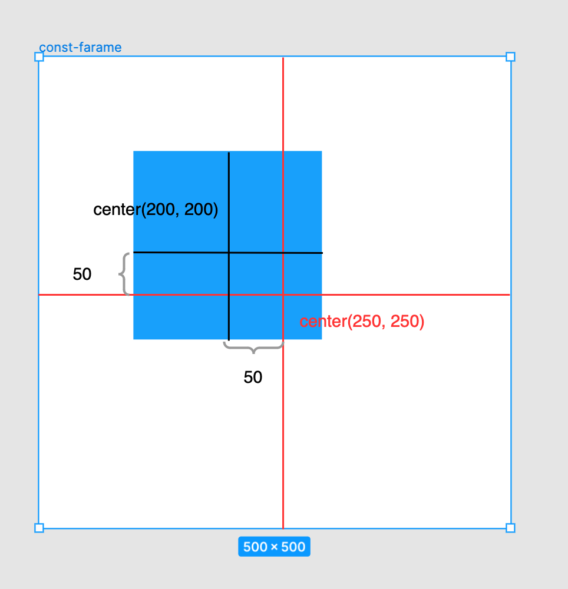

### 制約とは
対象のオブジェクト/フレームの位置を親オブジェクト/フレームからの相対位置で固定することができる機能

---

### 使い方

1\. 制約を設定したい(位置を固定したい)オブジェクト/フレームを指定する

 

2\. 右のパネルの Constraints にて、制約の種類を選択

 

---

### 制約の種類

### top, bottom, right, left

top, bottom, right, left は指定したオブジェクトから親要素までの top/bottom, rigth/left の位置を固定する制約

-> 従って、親要素のサイズを変更しても指定したオブジェクトは距離を保ってついてくる

 

例: 200x200 の正方形と 400x400 の親要素がある

200x200 の要素を指定し、 right, bottom の制約を設定した

結果、指定した水色の要素は親オブジェクトから　右から100、下から100 の距離に固定される

 
 

### center

center は指定したオブジェクトの中心と親要素の中心の距離を保つ制約

例: 400x400 の親要素に対して 200x200 の子要素が以下のように配置されている

 
 

Q: このとき子要素に center, center の制約をつけるとどうなるか?

A: 子要素の中心と、親要素の中心の距離を水平/垂直方向でも保とうとする

親要素のサイズを 500x500 に変更しても、子要素の中心と親要素の中心の距離は center の制約がつけられたときと同じ

 

### scale

scale は子要素のサイズと位置を親要素に対しての比率で維持する

 

例: 400x400 の親要素の中心に 200x200 のオブジェクトを配置した

 

Q: 水平 & 垂直方向に scale の制約を設定するとどうなるか?

A: 子要素は親要に対して 50% の大きさを維持し、位置も水平 & 垂直の両方向で中心に固定される

親要素のサイズを2倍の 800x800 に変更すると、子要素のサイズも2倍になり、位置も中央で固定されている

