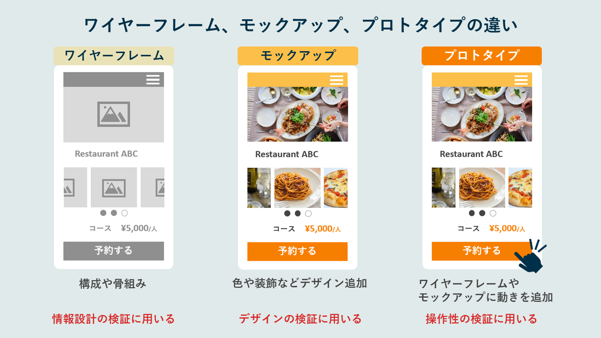

### デザインの草稿の種類

- Wire frame
    - アプリやwebサイトの骨組み

    - 白黒

    - 機能は無しで見た目だけ

 

- Mockup
    - 最終的なプロダクトのビジュアルデザイン

    - カラー有り(プロダクトの最終的な見た目だから)

    - 機能は無し

 

- Prototype
    - Mockup に機能を追加したもの

    -　ボタン押下時のエフェクトや遷移などの機能を備えたプロダクトの最終デザイン

 
 

[【初心者向け】ワイヤーフレームとは？ 作り方やツールを徹底解説](https://mieru-ca.com/heatmap/blog/what-is-wireframe/)