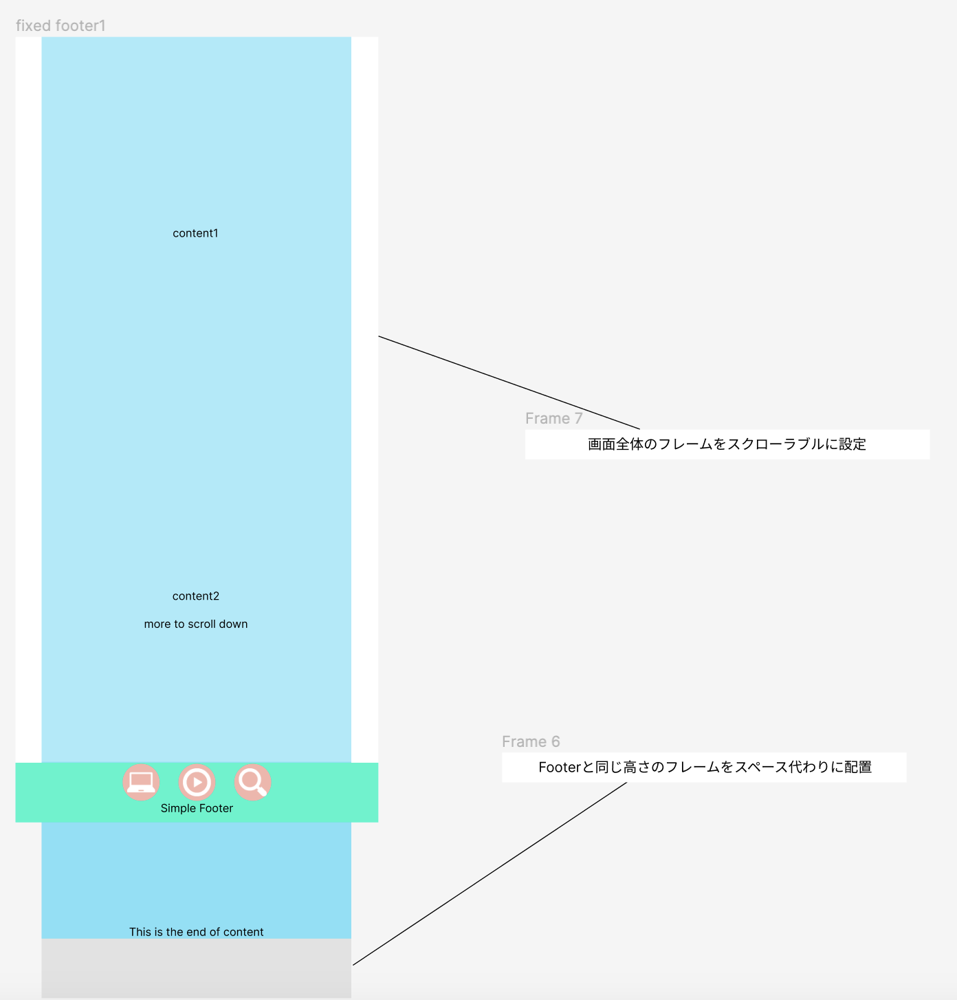
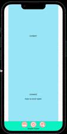
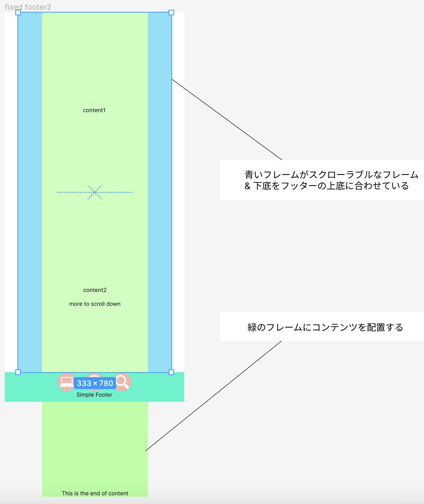
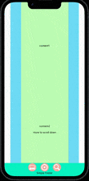

### Fixed Footer

固定をフッターを作ったつもりでも、コンテンツの最後がフッターに隠れて見えないことがよくある

---

### コンテンツの最後まで表示する方法

以下の2つの方法がある

1\. 最後にフッターと同じ高さのフレーム/オブジェクトを配置して、スペースを確保する

2\. スクローラブルなフレームを配置し、そのフレームの下底をフッターの上底に合わせる

---

### 1の方法

---

### 2の方法

*この方法で画面全体をスクローラブルなフレームとして使いたい場合、画面全体の高さを小さくしなければならなくなるので注意 (画面全体のフレームの下底をフッターの上底に合わせなければならない)

