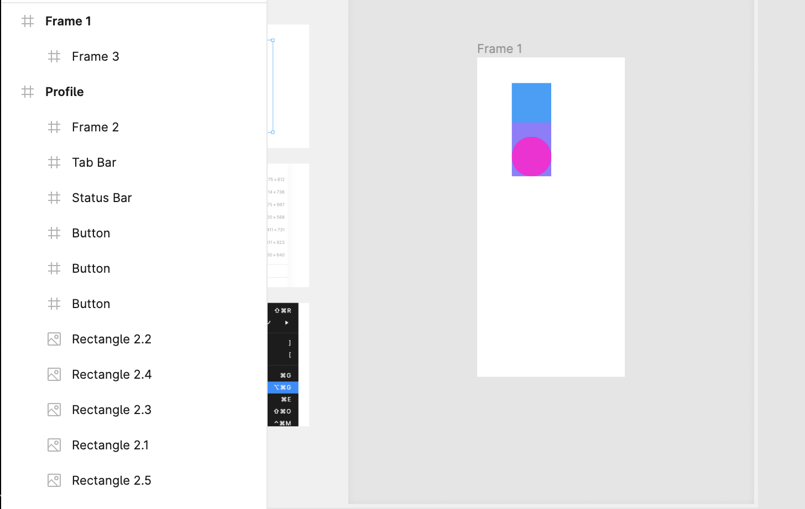
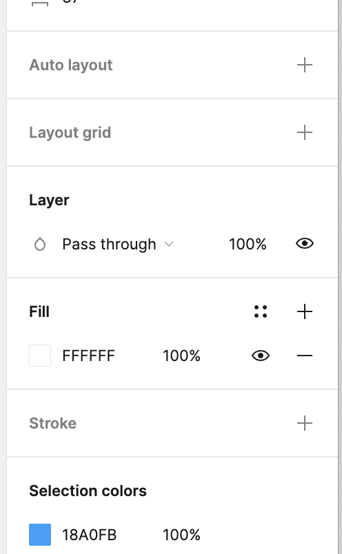
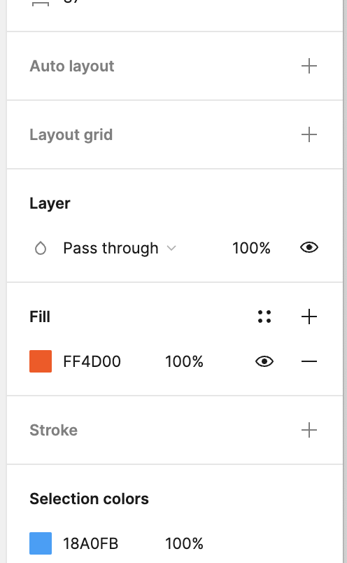
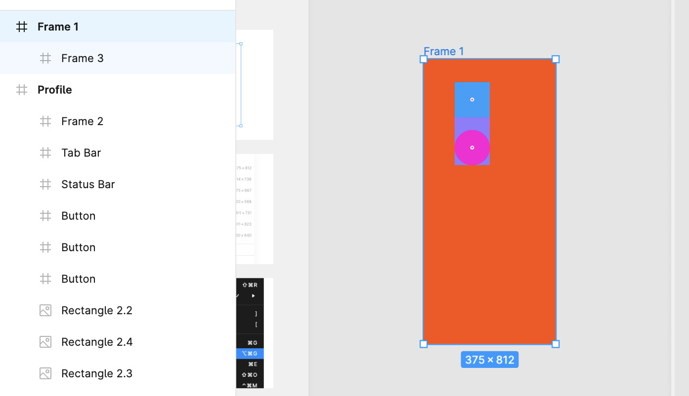

### Frame

- 名前の通り「枠」

- Figma でデザインするときの枠

- 多くの場合で、トップレベルのコンテナ

- フレームの中にフレームといった入れ子構造もできる

---

### 使い方　

ツールバーから # みたいな記号 (Frame) を選択し、フレームを選択する

1. マウスを使って、画面の任意の点をクリックしてからドラッグすると自分の好きなサイズでフレームを作成することができる

2. 画面右端に表示さるるフレームの候補から任意の定義済みのフレームを利用することができる

3. 選択したオブジェクトがピッタリ入るフレームを作成することができる

    1. フレームに含みたいオブジェクトを選択する

    2. 右クリックから "Frame Section" を選択する

---

#### フレームに色を塗る

1. フレームを選択する

 

2. 左のパネルにて "Fill" の FFFFFF を選択する

 

3. フレームに塗りたい色を設定する

 

4. フレームに設定した色が反映されることを確認する

