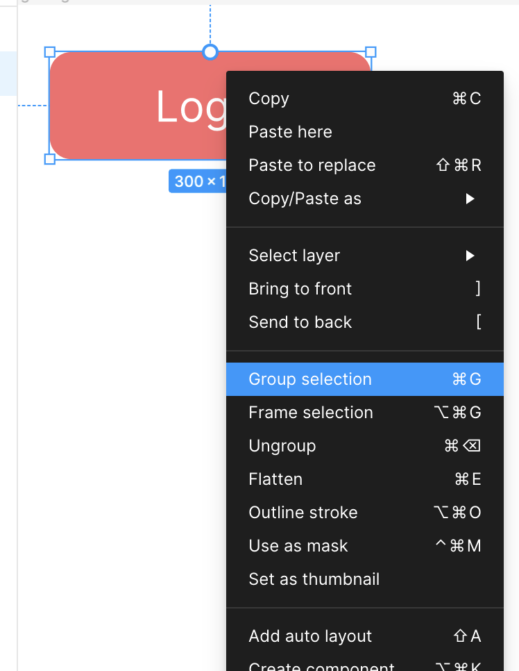
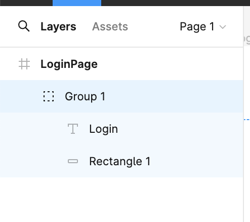
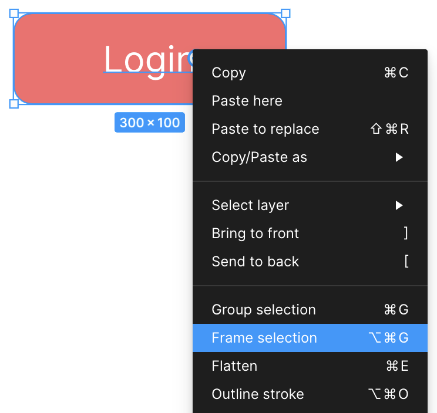
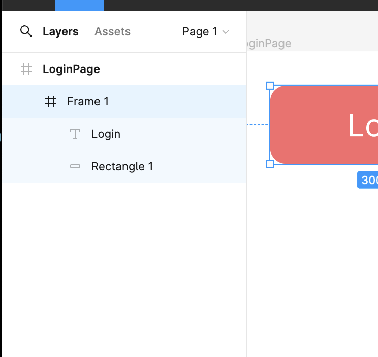
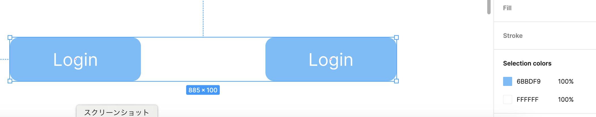
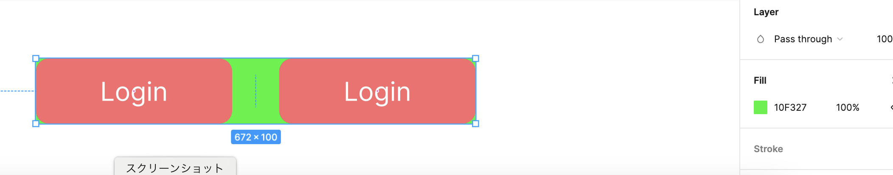

### Group　にまとめる

1\.複数のオブジェクトを選択し、右クリックで "Group Selection" を選択する

 

2\. 左のパネルにて、選択したオブジェクトが Group にまとめられていることを確認する

 

グループ化を解除する場合は右のパネルもしくは、グループ化したオブジェクトを右クリックで選択し、 "Ungroup" をクリックする

---

### Frame にまとめる

1\. 1つの Frame にまとめたいオブジェクトを選択し、　右クリックで "Frame Selection" を選択する

 

2\. 左のパネルにて、選択したオブジェクトが Frame にまとめられていることを確認する

 

Frame化を解除する場合は右のパネルもしくは、Frame化したオブジェクトを右クリックで選択し、 "Ungroup" をクリックする

---

### Group と Frame の違い

Group: 要素のグルーピング + 子要素のプロパティを一斉に適用できる

- 例: 2つの赤いボタンをグループ化し、グループの "Fill" を青に変更した

    -> グループの子要素の Fill が一斉に更新された
    

 

Frame: 要素のグルーピング + そのFrame自体にもデザインのプロパティを持つ

- 例: 2つの赤いボタンを1つの Frame にまとめ、 Frame の Fil を緑に変更した

    -> その Frame 自体の Fill が更新された
    

 

よって、**1つの UI コンポーネントとして作成したい場合は 1つのフレームにまとめる**

[最速でゆっくり Figma最新機能紹介 〜Section編 GroupやFrameとの違いとは〜](https://knowledge.sakura.ad.jp/33503/)