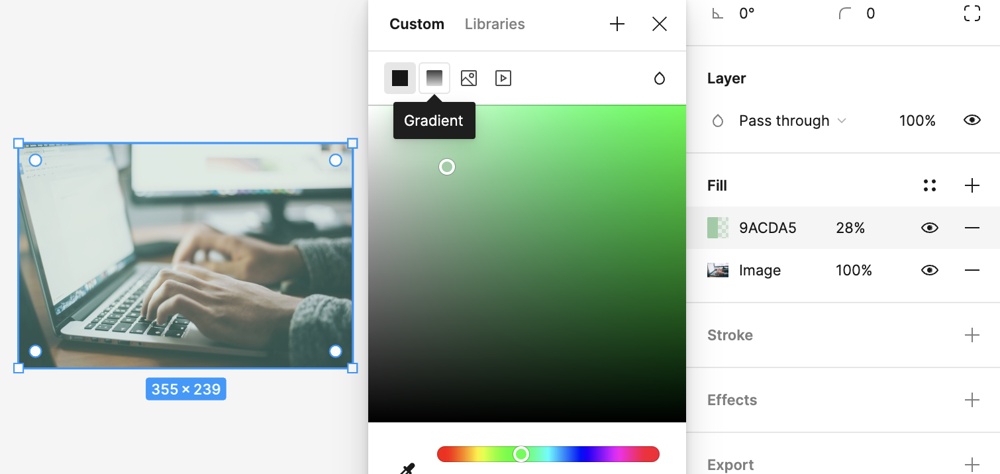
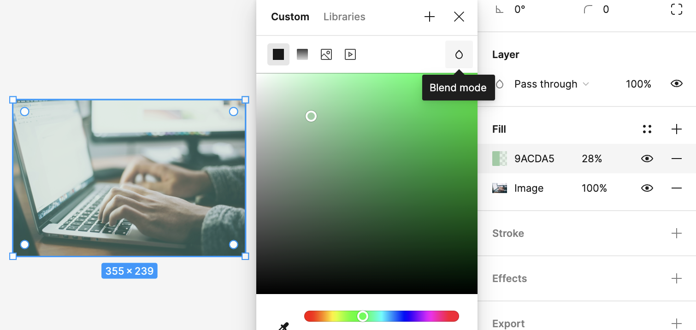
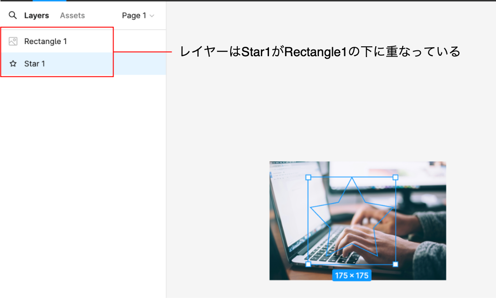
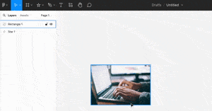
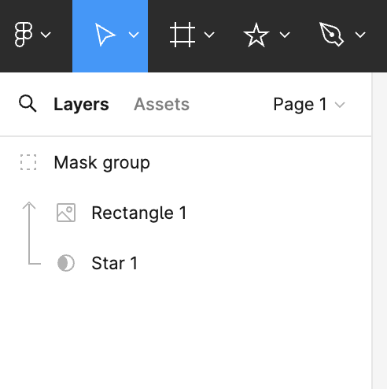
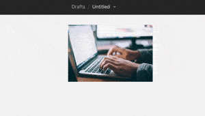
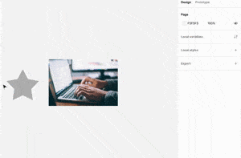

### Figma での画像

画像を配置する方法 (結果は同じ)

- オブジェクトの Fill に画像ファイルを指定する
- 画像ファイルを直接配置する

---

### 画像に fill を追加する (Adding anther fill)

画像オブジェクトにさらに fill を追加することで画像に色を重ねることができる

*色のレイヤーが画像レイヤーの上になっていること (レイヤの順番に注意)

1\. 画像オブジェクトに fill を追加する

 

2\. 色をグラデーションにしたり、ブレンドモードを指定することで、より細かく重ねる色を設定することができる

[4-3. オブジェクトに色を塗る](https://chot.design/figma-beginner/f64023a95af9/)

---

### 画像のマスキング (Masking)

オブジェクトを好きな形に切り抜くことができる

*トリミングと違い、マスキングするとマスクオブジェクトが作成される

*下のオブジェクトの形に沿って、上のオブジェクトが切り抜かれる

 

例: 画像を星型に切り抜く

1\. 画像と星型のオブジェクトを設置する

 

2\. 画像を星型オブジェクトの上に配置する

 

3\. 画像と星型オブジェクトの両方を選択し、上のツールバーもしくは右クリックから "Use as Mask" を選択

 

4\. レイヤーを確認すると Star1 がその上のオブジェクトをマスクしていることがわかる

 

[マスク(Figma公式)](https://help.figma.com/hc/ja/articles/360040450253-マスク)

---

### トリミング (Trimming)

画像のいらない部分を切り落とす機能

画像を配置後、上のツールバーにある crop image を選択し好きな部分を切り取る

---

### 画像から色を抽出する

fill のスポイトツールを利用することで選択した箇所の色を抽出することができる

