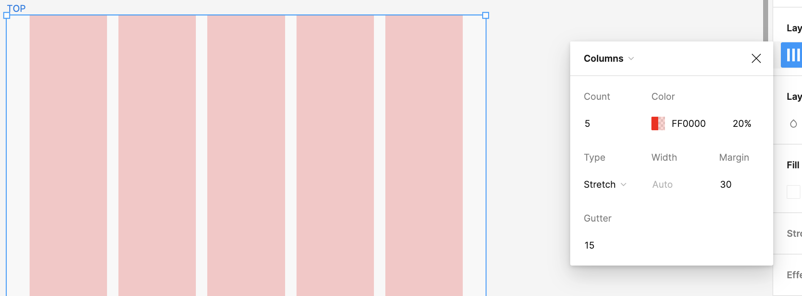

### レイアウトグリッドとは

フレーム内に、 grid / column / row 状のデザインガイドラインを表示する機能

あらゆるフレームに設定できるので、子フレームにも設定できる

---

### 使い方

1\. レイアウトグリッドを表示したいフレームを選択し、右のパネルから "Layout grid" を選択する

 

2\. 追加したレイアウトグリッドを右のパネルから選択することで、レイアウトグリッドの設定を変更することができる

---

### Grid

Size: マス目のサイズ

- Size: 10 の場合 1つのマス目の大きさは 10px * 10px

---

### Columns, Rows

Count: カラム(ロウ)の数

Gutter: 各カラム(ロウ)間の間隔 (px)

Type: カラム(ロウ)の配置方法

- stretch:　フレームのサイズに合わせて、カラム(ロウ)のサイズも変わる

    

    

 

- right / left / center (columns): フレームのサイズとは独立してカラムのサイズがある。また、カラムの場所はフレームのサイズ関係なく固定される

- top / center / bottom (rows): right / center / left のロウバージョン

    
    

 

width (right / left / centerの時のみ有効): カラム(ロウ)のサイズ

---

### 1つのフレームに複数のグリットを設定できる

