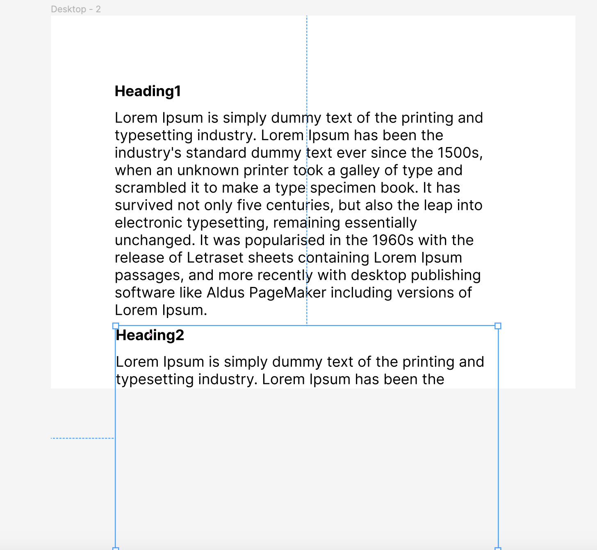
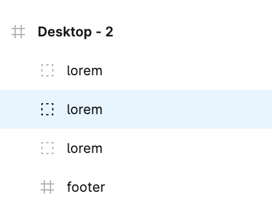
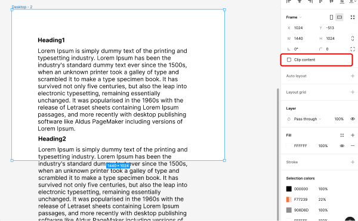
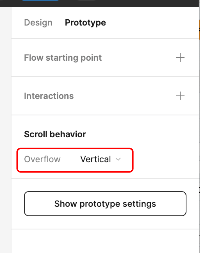
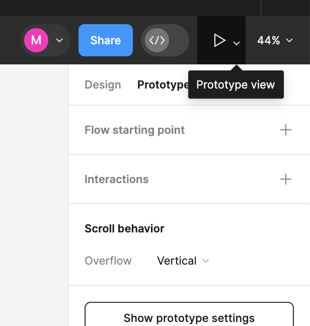
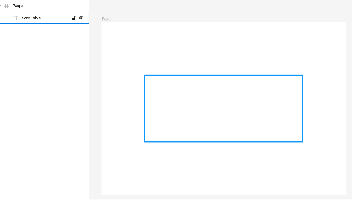
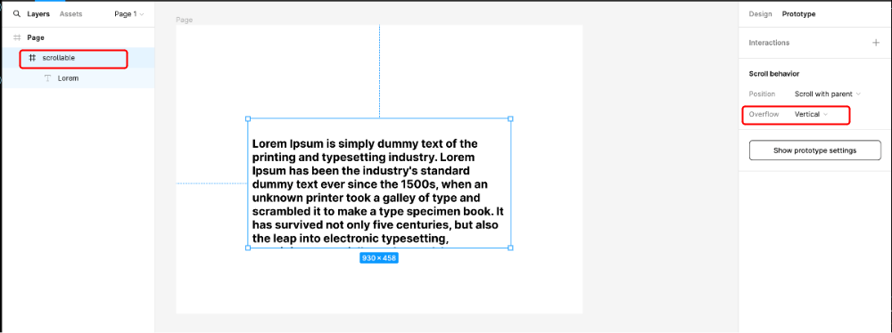

### スクロール可能なページの作り方

1. フレームからはみ出るようにオプジェクトや子フレームを配置する
    
    

    \* デフォルトでは親フレームをはみ出ると、そのオブジェクトは見えなくなる  
    -> 親フレームをはみ出してもその要素を visible にしたい場合、親フレームを選択し、　”Clip content” のチェックを外す

 

- この時、はみ出した要素(スクロールで表示したい要素)が、親フレームの子要素になっていることを確認する

    

 

- 親フレーム(Desktop-2)からはみ出した子要素も visible にしたい場合は 親フレームの "Clip content" のチェックを外す

    

 
 
 

2. 親フレームを選択し、右パネルの "Prototype" を選択し、 "Scroll behavior" を "vertical" に選択する

    

 
 
 

3. プロトタイプを再生し、作成したプロトタイプがスクロールではみ出したコンテンツが閲覧可能かを確認する

    

---

### 画面(フレーム)内の小さな領域(フレーム)内でスクロールするプロトタイプを作成する方法

 

1. 親フレームの中に、スクロール可能な要素(フレーム)を配置する

    

 

2. スクロール可能な要素の子要素として、はみ出す大きさの要素を配置

    

 

3. スクロールを可能にしたい要素(フレーム)の "Prototype" にて "overflow" を "vertical" にする

    

4. 最後にプロトタイプを再生し、要素がスクロール可能になっているか確認する