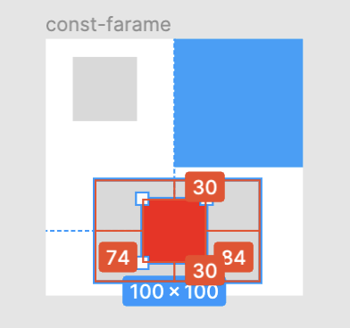
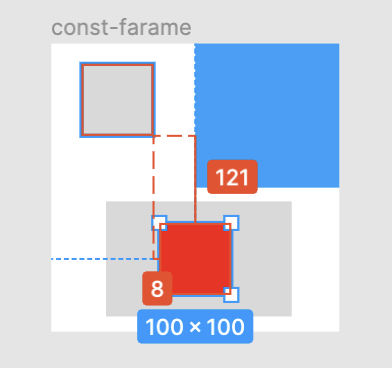

### 便利なショートカット

- 選択したオブジェクにズームイン
    - shift + 2

- 全体ページにズームアウトする
    - shift + 1

- オプジェクト/フレームの複製
    - option + shift を押しながら対象のオブジェクト/要素をドラッグ&ドロップ

- 入れ子になっている要素の子要素を1クリックで選択したい
    - ctr + command + クリック

---

### 対象のオブジェクトと、その他任意のオブジェクトとの距離を表示する

1. 対象のオブジェクト/フレームを選択する

 

2. そのオブジェクトとの距離をはかりオブジェクト/フレームに option キーを押しながらマウスをホバーする

- 親のグレー背景のオブジェクトに option を押しながらホバーすると

 

- 親子関係にないグレー背景のオブジェクトに option キーを押しながらホバーする

---

