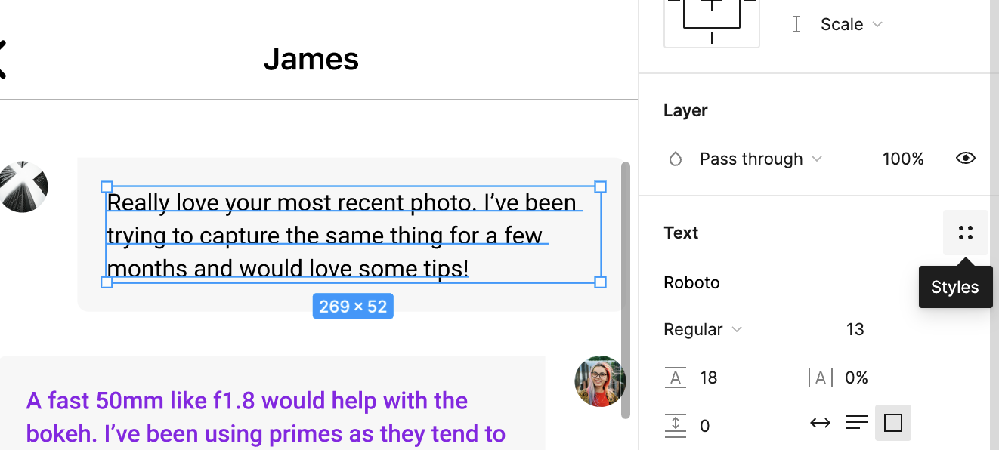
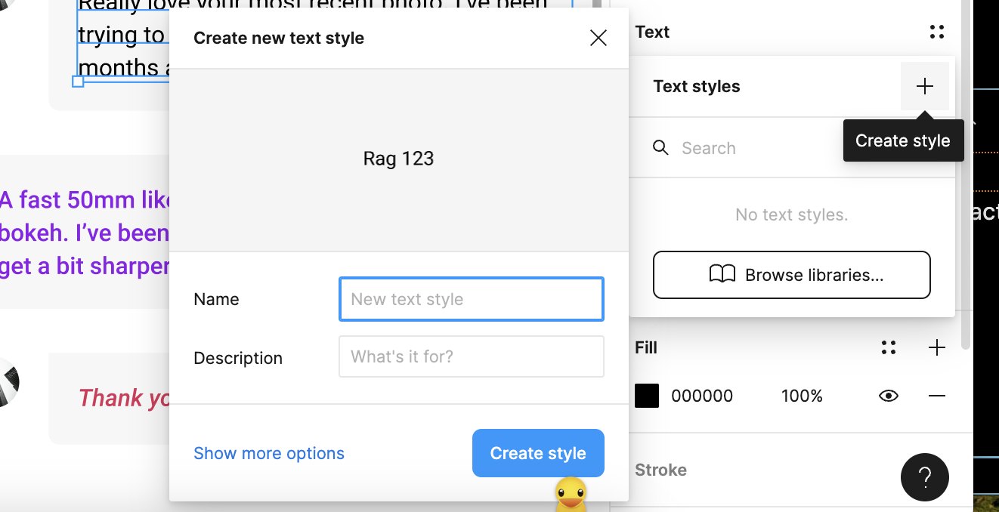
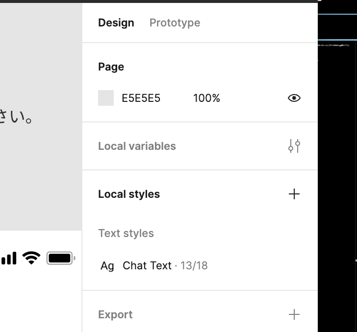
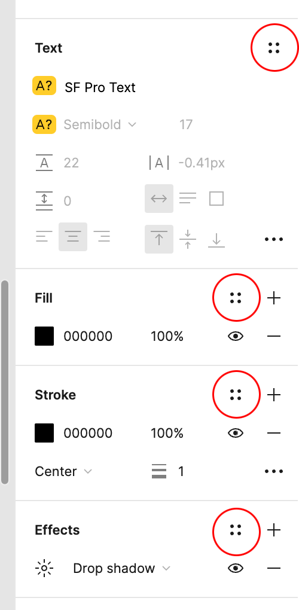
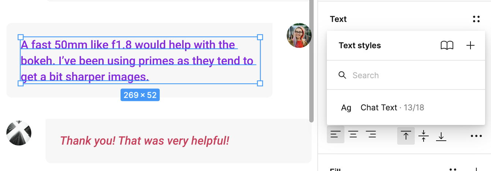
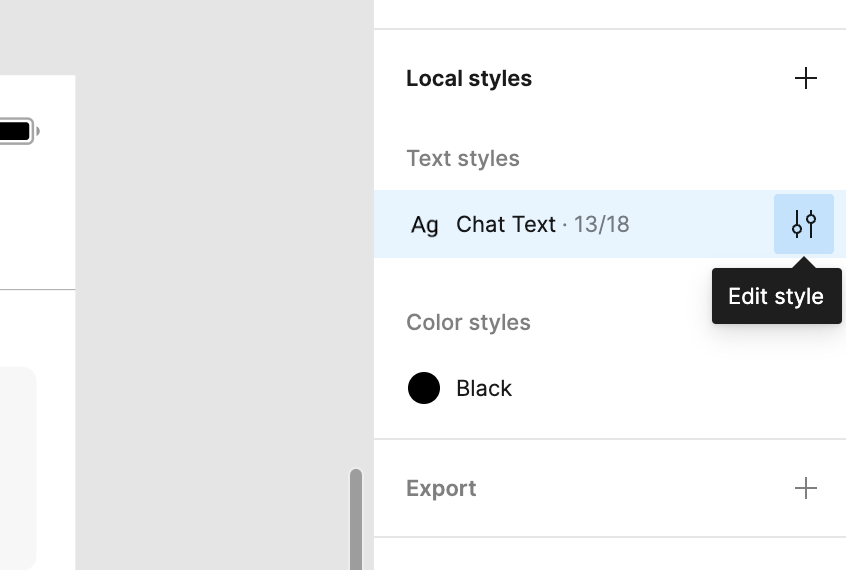
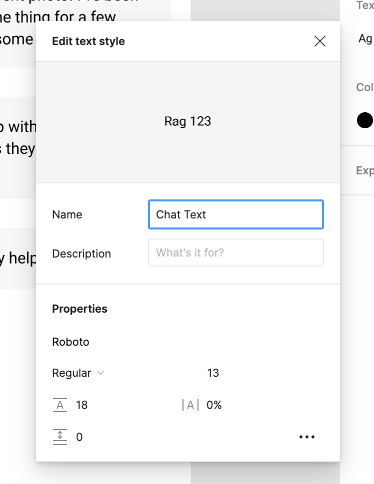

### Styles とは

オブジェクトの色やフォントなどのスタイルを定義することができ、そのスタイルを再利用することができる機能

---

### Style の定義方法

- テキストのスタイル定義方法

1. テキストオブジェクトを選択し、右のパネルの "Text" の "Styles" を選択

 

2. Text Style の "+" をクリックし、新たなテキストスタイルを定義する
    - **選択したテキストオブジェクトのスタイルが保存される**

 

3. スタイル定義後は、右のパネルの Local Styles に反映されている
    - Chat Text でスタイルを作成した

 

### text 以外のスタイルの定義も可能

Fill, Stroke, Effect などもスタイルの定義(登録)が可能

---

### 定義したスタイルの反映方法

1. スタイルを反映させたいオブジェクトを選択し、 Styles をクリックする
    - Chat Text が定義済みのスタイル

---

### 定義済みスタイルの更新

*定義済みのスタイルがすでに適用さてれているオブジェクトがある場合、スタイルを更新すると、そのオブジェクトにも反映される

 

1. 定義済みのスタイルから、更新したいスタイルから "Edit style" を選択する

 

2. "Properties" から更新したい項目を変更する

