### Variants とは

複数のデザインバリエーションのコンポーネントを1つのグループにまとめることができる機能

 

これを利用することで、

- 未チェックのチェックボックス
- チェック済みのチェックボックス
- disabled なチェックボックス 

を一つのコンポーネントグループにまとめることができ、チェックボックスのバリエーション管理ができる

---

### Variants の作り方

前提条件: Variants は components の集合なので、 component を作る必要がある

- 複数のプロパティを持たせることもできる
    - 大枠のvariantを選択
    - 右のパネルから properties -> variants を選択

---

### Variants の使い方

1\. バリエーションを持たせたいコンポーネントを作成する

- まずはコンポーネントの作成

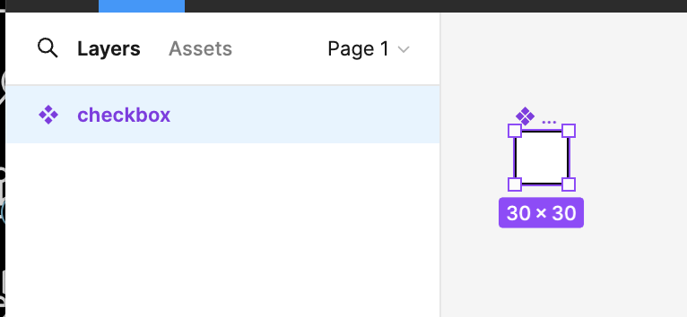

 

2\. Variants にまとめる

- 右のパネルから Properties -> Variant を選択
- コンポーネントが紫の枠線で囲まれたらOK

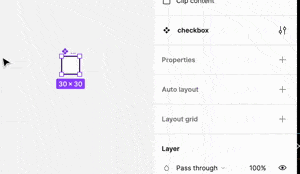

 

3\. 新しいバリエーションを作成する

- \+ をクリックして新しいコンポーネントを作成

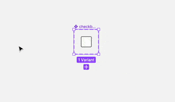

 

4\. 作成したコンポーネントに新しい Variant (バリエーション名のようなもの)を設定する

- disabled でクリック不可状態のコンポーネントを作成する

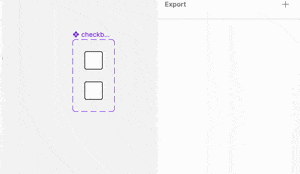

 

5\. 作成した新しいコンポーネントの見た目などを設定する

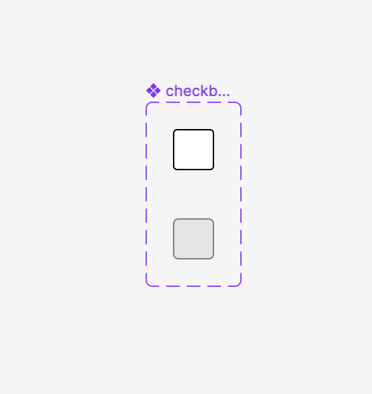

---

### variants の利用例

チェックボックスをクリックでチェックを入れたり外したりする

1\. ２種類のチェックボックの variants を作成する

- プロパティ名を state に設定する
- 1つのチェックボックスの state　は unchecked
- もう1つのチェックボックスの state は checked 

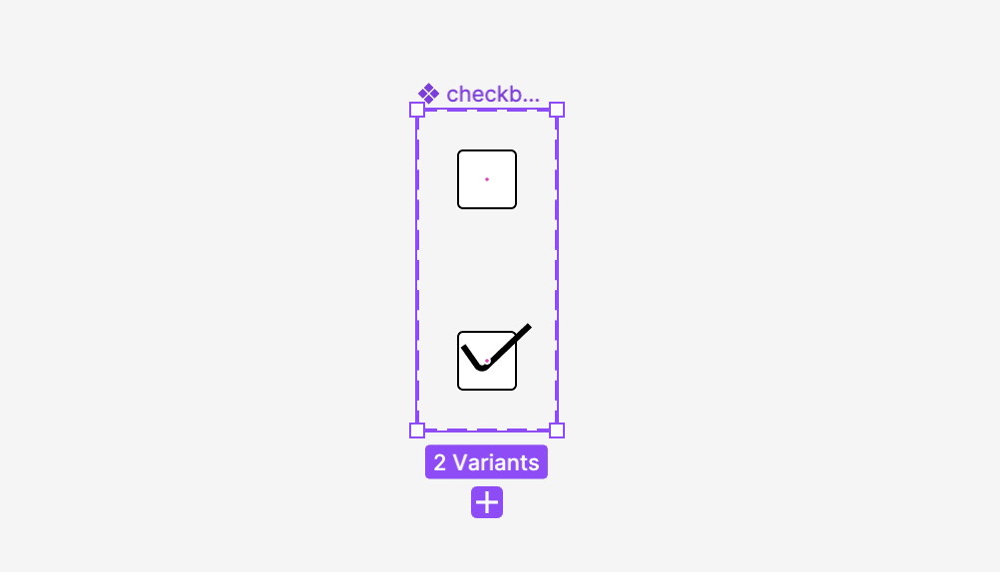

 

2\. チェックボックスコンポーネントからインスタンスを作成する

- uncked のインスタンスを作成する

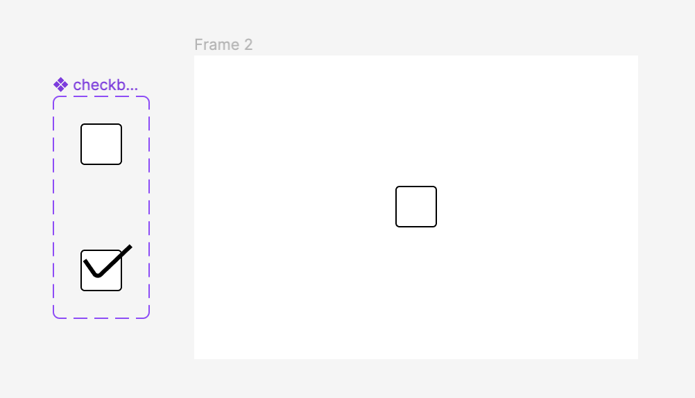

 

3\. 作成したインスタンスに interaction を設定する

- click したら change to で そのインスタンスの状態を checked に変更するように設定

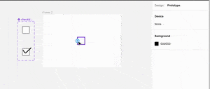

 

- 同様に checked のコンポーネントにて on Click 時に uncheck の state に変化するように設定

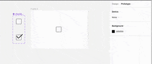

 

4\. proto type を再生し、意図した状態変化になっているかを確認

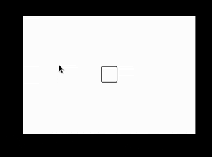

---

### プロパティ名

Variant には複数のプロパティ名をつけることができ、細かくバリエーションを管理することができる

 

例: プロパティ名に state と color を作成し、チェックボックスの状態と色のバリエーションを管理する

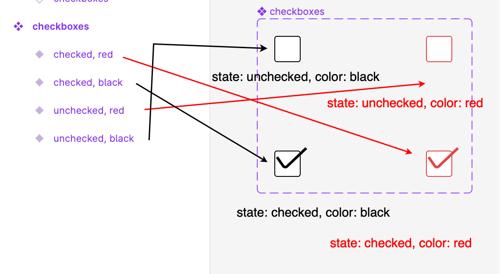

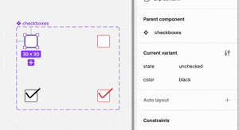

---

### プロパティ名の追加

1\. プロパティ名を追加したい Varinats (コンポーネントのグループ) を選択する

以下の方法で Varinats を選択できる

- 紫の枠を ctrl + クリック

- 左パネルからコンポーネントグループの親要素を選択

- どれつ1のコンポーネントを選択し、右パネルの　Parent component から、親要素(コンポーネントが属しているグループ) を選択

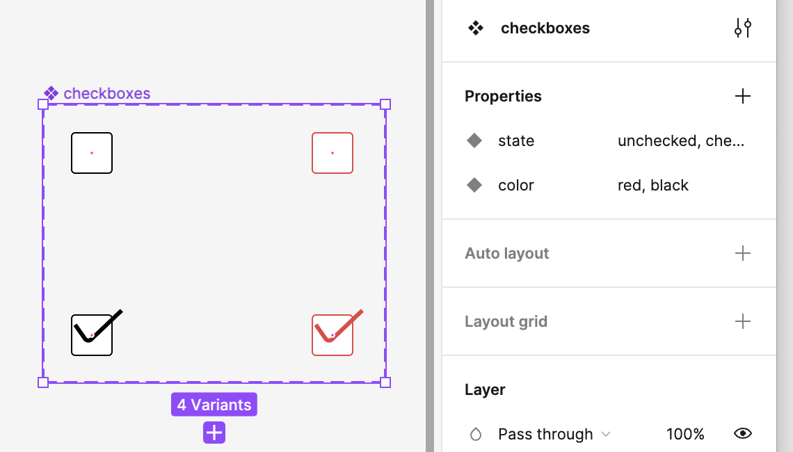

 

2\. 右パネルの Properies から　\+ で varinat を選択

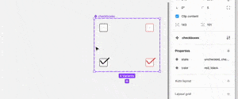

 

3\. 新しいプロパティ名と値を入力し、プロパティを作成

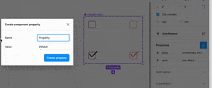

 

4\. 新しく作成したプロパティ名の値を各コンポーネントに設定する

- すでに作成済みのコンポーネントには、作成時のプロパティ値が設定されている (この例では size: samll)

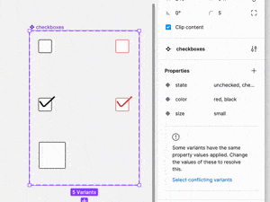

